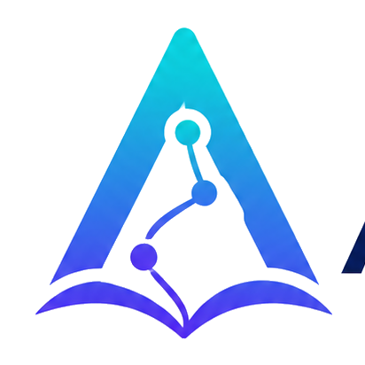

# Aethria

<p>
  
</p>

[](https://dotnet.microsoft.com/)
[](https://aspire.dev/)
[](https://react.dev/)
[](https://www.postgresql.org/)
[](https://qdrant.tech/)
[](https://azure.microsoft.com/)
[](https://modelcontextprotocol.io/)
[](LICENSE)

Aethria is an AI-assisted learning platform for managing learning resources, mentors, quizzes, roadmaps, notifications, and chat-based guidance.

The solution uses Clean Architecture on .NET 10, .NET Aspire for local orchestration, and a React 19 + TypeScript SPA for the user interface.

## Contents

- [Highlights](#highlights)
- [Tech Stack](#tech-stack)
- [Architecture](#architecture)
- [Project Structure](#project-structure)
- [Run Locally](#run-locally)
- [Configuration](#configuration)
- [Published Images](#published-images)
- [Contributing](#contributing)

## Highlights

| Area | Capabilities |
| --- | --- |
| Authentication | Email/password login, Google sign-in, JWT access tokens, refresh-token cookies, and password changes. |
| Resources | Upload learning files, parse and chunk content, store files in Azure Blob Storage, search with Qdrant vectors, rerank with Cohere, and chat with uploaded resources. |
| Mentors | Create validated mentor profiles and chat with mentor-specific agents. |
| Roadmaps | Generate AI learning roadmaps with streaming updates and notification events. |
| Quizzes | Create blank quizzes, generate AI quizzes, submit attempts, view history, and review submissions. |
| Realtime UX | SignalR-powered chat and notification flows. |
| MCP | Protected Model Context Protocol server for external AI clients using API-key authentication. |

## Tech Stack

| Layer | Main tools |
| --- | --- |
| Backend | .NET 10, ASP.NET Core Minimal APIs, SignalR, DispatchR, FluentValidation |
| Data | Entity Framework Core, PostgreSQL, ASP.NET Identity |
| AI and search | Azure AI Foundry / Azure OpenAI, Qdrant, Cohere reranking, Tavily |
| Storage | Azure Blob Storage |
| Orchestration | .NET Aspire |
| Frontend | React 19, TypeScript, Vite, Mantine, TanStack Router, React Query, i18next |
| Integration | Model Context Protocol server |

## Architecture

```text
User browser
   |
   v
aethria.web  ---- REST / SignalR ---->  Aethria.Api
   |
   v
Aethria.Application
   |
   v
Aethria.Infrastructure
   |
   v
Aethria.Domain

Aethria.McpServer
   |
   +--> Aethria.Application / Aethria.Infrastructure

Aethria.AppHost
   |
   +--> Local Aspire orchestration for API, MCP server, and web client
```

| Project | Responsibility |
| --- | --- |
| `Aethria.Domain` | Core entities, value objects, domain events, and repository contracts. |
| `Aethria.Application` | DispatchR use cases, validation pipelines, service abstractions, and API/MCP service registration. |
| `Aethria.Infrastructure` | EF Core persistence, Identity, Azure Blob Storage, embeddings, chunking, Qdrant vector search, AI reranking, AI agents, and feature registrations. |
| `Aethria.Api` | REST endpoints, SignalR hubs, JWT authentication, OpenAPI, Scalar UI, and full API composition. |
| `Aethria.McpServer` | Protected MCP server with resource-chat tools for AI clients. |
| `Aethria.AppHost` | .NET Aspire host for local distributed orchestration. |
| `Aethria.ServiceDefaults` | Shared telemetry, resilience, service discovery, and health-check configuration. |
| `aethria.web` | React SPA using Mantine, TanStack Router, React Query, SignalR, and i18next. |

## Project Structure

```text
aethria/
├── Aethria.AppHost/             # .NET Aspire local orchestration
│   ├── AppHost.cs
│   └── appsettings.json
├── Aethria.Api/                 # REST API, SignalR, auth, OpenAPI, Scalar UI
│   ├── Authentication/
│   ├── Endpoints/
│   ├── Hubs/
│   └── Program.cs
├── Aethria.McpServer/           # Protected MCP server for AI integrations
│   ├── Authentication/
│   ├── Tools/
│   └── Program.cs
├── Aethria.Domain/              # Entities, events, repository contracts, value objects
│   ├── Common/
│   ├── Entities/
│   ├── Events/
│   ├── Repositories/
│   └── ValueObjects/
├── Aethria.Application/         # Use cases, validation, abstractions
│   ├── Abstractions/
│   ├── Behaviors/
│   ├── UseCases/
│   └── DependencyInjection.cs
├── Aethria.Infrastructure/      # Persistence, storage, AI, vector search
│   ├── AgentFramework/
│   ├── Chunking/
│   ├── Configuration/
│   ├── Identity/
│   ├── Persistence/
│   ├── Repositories/
│   ├── Storage/
│   ├── VectorSearch/
│   └── DependencyInjection.cs
├── Aethria.ServiceDefaults/     # Shared service defaults
├── aethria.web/                 # React + TypeScript + Vite SPA
│   ├── public/
│   └── src/
│       ├── components/
│       ├── i18n/
│       ├── pages/
│       ├── services/
│       ├── main.tsx
│       └── router.tsx
└── docker-compose.yml
```

## Run Locally

### Prerequisites

- .NET 10 SDK
- Node.js
- PostgreSQL database
- Qdrant instance
- Azure Blob Storage account
- Azure AI Foundry / Azure OpenAI access
- Tavily key for chat agents that can search the web

### Recommended: Aspire

Fill `Aethria.AppHost/appsettings.Development.json`, then run:

```bash
dotnet restore
dotnet run --project Aethria.AppHost
```

`Aethria.AppHost` reads the Aspire parameters and passes them to the services it starts.

### API only

Fill `Aethria.Api/appsettings.Development.json`, then run:

```bash
dotnet run --project Aethria.Api
```

### MCP server only

Fill `Aethria.McpServer/appsettings.Development.json`, then run:

```bash
dotnet run --project Aethria.McpServer
```

### Web client only

```bash
cd aethria.web
npm install
npm run dev
```

If the Vite origin is different from the API CORS configuration, add it to `Cors` in `Aethria.Api/appsettings.Development.json`.

## Configuration

Keep local secrets in `appsettings.Development.json`, user secrets, or `.env` files that are not committed. Do not place real connection strings or API keys in README examples.

### AppHost parameters

`Aethria.AppHost/appsettings.Development.json`:

```json
{
  "Parameters": {
    "DefaultConnection": "<postgres-connection-string>",
    "FoundryProjectEndpoint": "<azure-ai-foundry-project-endpoint>",
    "FoundryAzureOpenAIEndpoint": "<azure-openai-endpoint>",
    "FoundryApiKey": "<azure-ai-foundry-or-openai-api-key>",
    "TavilyApiKey": "<tavily-api-key>",
    "AzureStorageConnectionString": "<azure-storage-connection-string>",
    "AuthIssuer": "Aethria",
    "AuthAudience": "Aethria.Api",
    "AuthSigningKey": "<long-local-signing-key>",
    "AuthAccessTokenMinutes": "15",
    "AuthRefreshTokenDays": "7",
    "AuthRefreshTokenCookieName": "aethria.refresh_token",
    "AuthGoogleClientId": "<google-oauth-client-id>",
    "QdrantEndpoint": "<qdrant-endpoint>",
    "QdrantApiKey": "<qdrant-api-key>"
  }
}
```

### API appsettings

`Aethria.Api/appsettings.Development.json`:

```json
{
  "ConnectionStrings": {
    "DefaultConnection": "<postgres-connection-string>"
  },
  "Foundry": {
    "ProjectEndpoint": "<azure-ai-foundry-project-endpoint>",
    "AzureOpenAIEndpoint": "<azure-openai-endpoint>",
    "ApiKey": "<azure-ai-foundry-or-openai-api-key>"
  },
  "Tavily": {
    "ApiKey": "<tavily-api-key>"
  },
  "AzureStorage": {
    "ConnectionString": "<azure-storage-connection-string>"
  },
  "Qdrant": {
    "Endpoint": "<qdrant-endpoint>",
    "ApiKey": "<qdrant-api-key>"
  },
  "Auth": {
    "Issuer": "Aethria",
    "Audience": "Aethria.Api",
    "SigningKey": "<long-local-signing-key>",
    "AccessTokenMinutes": 15,
    "RefreshTokenDays": 7,
    "RefreshTokenCookieName": "aethria.refresh_token",
    "GoogleClientId": "<google-oauth-client-id>"
  }
}
```

### API environment variables

| Environment variable | Required | Value |
| --- | --- | --- |
| `ConnectionStrings__DefaultConnection` | Yes | PostgreSQL connection string. |
| `Foundry__ProjectEndpoint` | Yes | Azure AI Foundry project endpoint for Foundry-hosted model/provider APIs. |
| `Foundry__AzureOpenAIEndpoint` | Yes | Azure OpenAI endpoint for deployed OpenAI-compatible models. |
| `Foundry__ApiKey` | Yes | Azure AI Foundry / Azure OpenAI API key. |
| `Tavily__ApiKey` | Yes | Tavily API key used by chat agents that can search the web. |
| `AzureStorage__ConnectionString` | Yes | Azure Blob Storage connection string for uploaded resources. |
| `Qdrant__Endpoint` | Yes | Qdrant endpoint for resource chunk vectors. |
| `Qdrant__ApiKey` | Yes | Qdrant API key. |
| `Auth__Issuer` | Yes | JWT issuer. |
| `Auth__Audience` | Yes | JWT audience, normally `Aethria.Api`. |
| `Auth__SigningKey` | Yes | Long secret used to sign JWT access tokens. |
| `Auth__AccessTokenMinutes` | Yes | Access token lifetime in minutes. |
| `Auth__RefreshTokenDays` | Yes | Refresh token lifetime in days. |
| `Auth__RefreshTokenCookieName` | Yes | Cookie name used for refresh tokens. |
| `Auth__GoogleClientId` | Yes | Google OAuth client ID used to validate Google ID tokens. |
| `Cors__0__Origins__0` | Optional | First allowed web origin, for example `http://localhost:53174`. Add more origins as `Cors__0__Origins__1`, etc. |
| `Cors__0__AllowedMethods__0` | Optional | Use `*` for all methods in local development. |
| `Cors__0__AllowedHeaders__0` | Optional | Use `*` for all headers in local development. |
| `Cors__0__AllowCredentials` | Optional | Set to `true` when the browser must send refresh-token cookies. |
| `ASPNETCORE_ENVIRONMENT` | Optional | Set to `Development` for local development. |

### MCP server appsettings

`Aethria.McpServer/appsettings.Development.json`:

```json
{
  "ConnectionStrings": {
    "DefaultConnection": "<postgres-connection-string>"
  },
  "Foundry": {
    "ProjectEndpoint": "<azure-ai-foundry-project-endpoint>",
    "AzureOpenAIEndpoint": "<azure-openai-endpoint>",
    "ApiKey": "<azure-ai-foundry-or-openai-api-key>"
  },
  "Qdrant": {
    "Endpoint": "<qdrant-endpoint>",
    "ApiKey": "<qdrant-api-key>"
  }
}
```

### MCP server environment variables

| Environment variable | Required | Value |
| --- | --- | --- |
| `ConnectionStrings__DefaultConnection` | Yes | PostgreSQL connection string. Use the same database as `Aethria.Api` so API keys can be validated. |
| `Foundry__ProjectEndpoint` | Yes | Azure AI Foundry project endpoint for Foundry-hosted model/provider APIs. |
| `Foundry__AzureOpenAIEndpoint` | Yes | Azure OpenAI endpoint for deployed OpenAI-compatible models. |
| `Foundry__ApiKey` | Yes | Azure AI Foundry / Azure OpenAI API key. |
| `Qdrant__Endpoint` | Yes | Qdrant endpoint for resource chunk vectors. |
| `Qdrant__ApiKey` | Yes | Qdrant API key. |
| `ASPNETCORE_ENVIRONMENT` | Optional | Set to `Development` for local development. |

The MCP server uses the same database as the API for API-key authentication. Create an API key through `Aethria.Api`, then call the MCP endpoint with the `X-Api-Key` header.

### Variable reference

| AppHost parameter / appsettings key / environment variable | Used by | Meaning |
| --- | --- | --- |
| `DefaultConnection` / `ConnectionStrings:DefaultConnection` / `ConnectionStrings__DefaultConnection` | AppHost, API, MCP | PostgreSQL connection string used for application data, identity, API keys, resources, quizzes, roadmaps, and notifications. |
| `QdrantEndpoint` / `Qdrant:Endpoint` / `Qdrant__Endpoint` | AppHost, API, MCP | Qdrant endpoint used to store and search resource chunk embeddings. |
| `QdrantApiKey` / `Qdrant:ApiKey` / `Qdrant__ApiKey` | AppHost, API, MCP | API key used to authenticate Qdrant requests. |
| `FoundryProjectEndpoint` / `Foundry:ProjectEndpoint` / `Foundry__ProjectEndpoint` | AppHost, API, MCP | Azure AI Foundry project endpoint for Foundry-hosted model/provider APIs. |
| `FoundryAzureOpenAIEndpoint` / `Foundry:AzureOpenAIEndpoint` / `Foundry__AzureOpenAIEndpoint` | AppHost, API, MCP | Azure OpenAI endpoint for deployed OpenAI-compatible models. |
| `FoundryApiKey` / `Foundry:ApiKey` / `Foundry__ApiKey` | AppHost, API, MCP | API key for Azure AI Foundry or Azure OpenAI requests. |
| `TavilyApiKey` / `Tavily:ApiKey` / `Tavily__ApiKey` | AppHost, API | Tavily API key used by the general chat agent for web search. |
| `AzureStorageConnectionString` / `AzureStorage:ConnectionString` / `AzureStorage__ConnectionString` | AppHost, API | Azure Blob Storage connection string used for uploaded learning resources. |
| `AuthIssuer` / `Auth:Issuer` / `Auth__Issuer` | AppHost, API | JWT issuer value. It must match the issuer used when validating access tokens. |
| `AuthAudience` / `Auth:Audience` / `Auth__Audience` | AppHost, API | JWT audience value. For local development, use `Aethria.Api`. |
| `AuthSigningKey` / `Auth:SigningKey` / `Auth__SigningKey` | AppHost, API | Secret key used to sign and validate JWT access tokens. Use a long random value locally. |
| `AuthAccessTokenMinutes` / `Auth:AccessTokenMinutes` / `Auth__AccessTokenMinutes` | AppHost, API | Access token lifetime in minutes. |
| `AuthRefreshTokenDays` / `Auth:RefreshTokenDays` / `Auth__RefreshTokenDays` | AppHost, API | Refresh token lifetime in days. |
| `AuthRefreshTokenCookieName` / `Auth:RefreshTokenCookieName` / `Auth__RefreshTokenCookieName` | AppHost, API | Name of the cookie that stores the refresh token. |
| `AuthGoogleClientId` / `Auth:GoogleClientId` / `Auth__GoogleClientId` | AppHost, API | Google OAuth client ID used to validate Google sign-in tokens. |
| `Cors` | API | Allowed local web origins. Keep `http://localhost:53174` when using the Aspire-hosted Vite app, or add your own web client origin. |

## Published Images

The API and MCP server are published as public images on GitHub Container Registry. No registry login is required.

| Service | Image |
| --- | --- |
| API | `ghcr.io/ngcsontrh/aethria/aethria-api:latest` |
| MCP server | `ghcr.io/ngcsontrh/aethria/aethria-mcpserver:latest` |

Versioned images are also published from release tags:

- `api-v1.0.0` publishes `ghcr.io/ngcsontrh/aethria/aethria-api:v1.0.0`
- `mcpserver-v1.0.0` publishes `ghcr.io/ngcsontrh/aethria/aethria-mcpserver:v1.0.0`

Pull the images:

```bash
docker pull ghcr.io/ngcsontrh/aethria/aethria-api:latest
docker pull ghcr.io/ngcsontrh/aethria/aethria-mcpserver:latest
```

Run with Compose after filling environment values in your local Compose file or `env_file` entries:

```bash
docker compose pull aethria-api aethria-mcpserver
docker compose up -d aethria-api aethria-mcpserver
```

Run without Compose:

```bash
docker run -d \
  --name aethria-api \
  --restart unless-stopped \
  -p 5250:8080 \
  --env-file api.env \
  ghcr.io/ngcsontrh/aethria/aethria-api:latest

docker run -d \
  --name aethria-mcpserver \
  --restart unless-stopped \
  -p 5261:8080 \
  --env-file mcpserver.env \
  ghcr.io/ngcsontrh/aethria/aethria-mcpserver:latest
```

Use the environment variable names from the API and MCP server tables above. At minimum, configure the database, Foundry/OpenAI, Qdrant, authentication, storage, and CORS values required by the service you are starting.

## Contributing

Contributions are welcome. Please open an issue for bugs, feature ideas, documentation gaps, or questions before starting large changes.

Good areas to improve:

- Backend API endpoints, application use cases, validation, and persistence.
- AI learning features, resource parsing, vector search, reranking, and MCP tools.
- Frontend UX, localization, accessibility, and React Query/TanStack Router flows.
- Documentation, examples, local setup notes, tests, and deployment guidance.

Before opening a pull request:

- Keep changes focused and consistent with the existing Clean Architecture boundaries.
- Avoid committing secrets, local credentials, generated build output, or machine-specific settings.
- Run relevant checks, such as `dotnet restore`, `dotnet build`, and frontend package/build commands when the web client changes.
- Describe the problem, the approach, and the verification performed.
